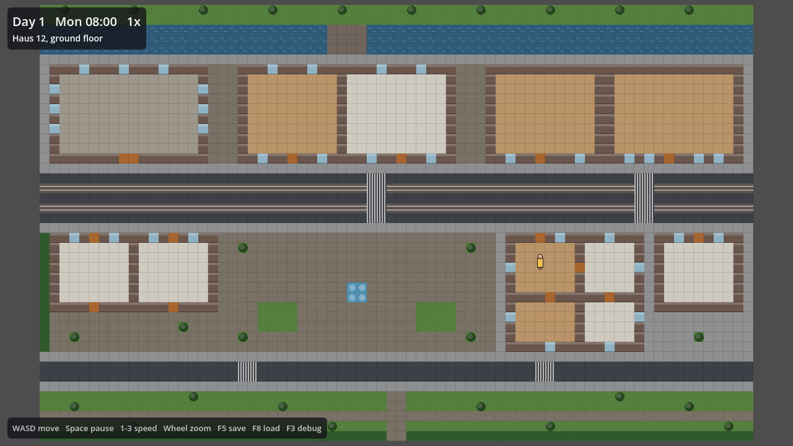

# Last Tram

A single-player, top-down, open-world **life sim sandbox** set in a gritty modern European
town: The Sims meets GTA. Work, love, build a home, or live on the other side of the law,
while everyone else in town lives their own life and remembers what you did.

Built with **Godot 4.7**, entirely by AI agents: Claude Code (Opus 5.5) as architect,
reviewer and artist, and OpenCode (DS v4.1 Flash, Muse Spark 1.3) as builders.



## Play the current build

```bash
tools/run.sh
```

Or open Godot → **Import** → `project.godot` → press **F5**.
After cloning on a new machine, run `tools/setup.sh` once (it enables the pre-commit check).

WASD move · Space pause · 1/2/3 speed · mouse wheel zoom · F5 save · F8 load · F3 debug

## Where things are

| | |
|---|---|
| [docs/vision.md](docs/vision.md) | What the game is: pillars, tone, rules |
| [docs/roadmap.md](docs/roadmap.md) | Milestones M0–M7 and what you can do after each |
| [docs/workflow.md](docs/workflow.md) | **How to drive the agents** (start here) |
| [docs/design/](docs/design/) | How each system works (time, world, people, character and looks, actions, tiers, jobs, social, crime, building, transport, UI, content packs) |
| [docs/architecture.md](docs/architecture.md) | How the code is organised and why |
| [docs/art.md](docs/art.md) | Art direction and the art pipeline |
| [tickets/](tickets/) | The work queue (`tools/tickets.sh`) |
| [AGENTS.md](AGENTS.md) / [CLAUDE.md](CLAUDE.md) | Rules for the AI agents |

## Status

M0 (Foundation) is done. **M1 · A Day at Home** is in progress. See the
[roadmap](docs/roadmap.md).
