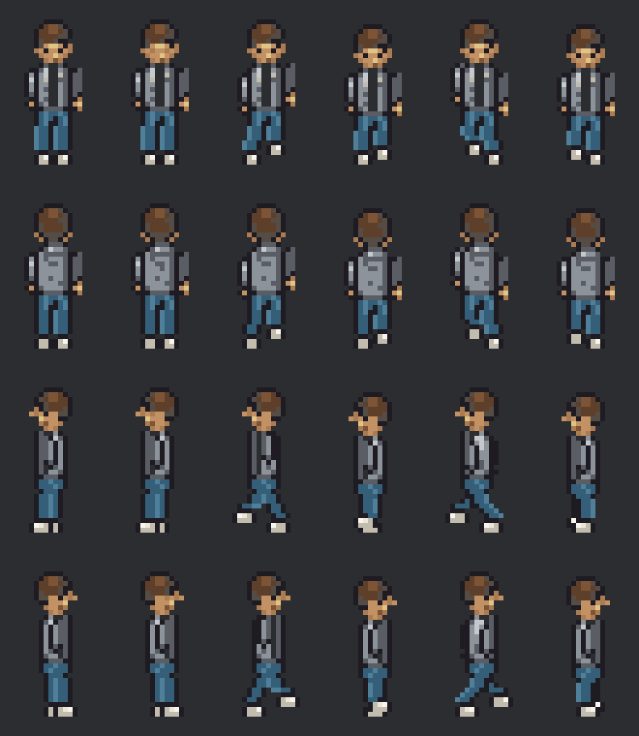

# Alex Novak

Original art for the default adult player in `data/appearance/default_player.json`:
short dark-brown hair, olive skin, an open grey hoodie over a black T-shirt, denim jeans,
and white trainers. The nearest shades from the existing route B palette are used.
This captures Alex's default look; it is not a renderer for arbitrary character-creator choices.

The review sheet's rows are down, up, left, right. In each row, the first two poses are
idle and the next four are the walking cycle.

## Files

- `alex_novak.aseprite`: editable 16×32 RGBA source, 24 frames, 17 opaque colours.
- `art/export/custom/characters/alex_novak.png` + `.json`: untrimmed packed atlas and
  Aseprite frame/tag metadata. Identical passing poses share atlas regions.
- `art/export/custom/characters/alex_novak.tres`: Godot 4 `SpriteFrames`, with all eight
  animation names and original frame timing.
- `alex_novak_idle.png`: transparent down-facing idle at native resolution.
- `alex_novak_preview.gif`: all directions and animations at 8×; `walk_<direction>.gif`
  loops individual walks at 6×. These enlarged previews are for review, not gameplay.

## Layers and timing

Bottom to top: `body_skin`, `feet_trainers`, `bottom_jeans`, `top_t_shirt`, `outer_hoodie`,
`hair_short`. Garment outlines belong to the garment. The shirt continues beneath the hoodie.
There is no ground shadow or player marker baked into the character.

| Animation | Frames | Timing |
|---|---:|---|
| `idle_down`, `idle_up`, `idle_left`, `idle_right` | 2 each | 1850 ms resting, 150 ms blink / hood movement |
| `walk_down`, `walk_up`, `walk_left`, `walk_right` | 4 each | 120 ms per frame, 480 ms per cycle |

Every frame retains its 16×32 canvas and transparent bottom row. Feet origin is **(8,31)**,
also recorded in the source's `feet_origin` slice. For a centred `AnimatedSprite2D`,
use `offset = Vector2(0, -15)` to put that origin on its node position. Use nearest filtering.
The existing game still uses `PersonDrawer2D`; this asset is ready for its later sprite integration.

## Rebuild

Run `node art/src/custom/characters/draw_alex_novak.mjs` from the project. It reads the
palette directly from `draw_custom.lua`, writes `out/alex_novak/edit_plan.json`, and
regenerates the review PNG. The JavaScript has no external dependencies.

With Aseprite MCP, create a new transparent 16×32 RGB sprite, apply the plan's palette,
then apply its operations in order in batches of **at most 500**. Remove the initial empty
`Layer 1` after the six named layers are added. Use the standalone `add_slice` tool with
the plan's `slice` object to preserve the feet pivot. Export with `export_godot_spriteframes`,
setting `texture_res_path` to `res://art/export/custom/characters/alex_novak.png`.
Copy the source and exports from the MCP workspace into the paths above.

Validation: `tools/check.sh` checks resource loading, animation timing, atlas alignment,
binary transparency and palette membership. Inspect the PNG and GIF previews after changes.
