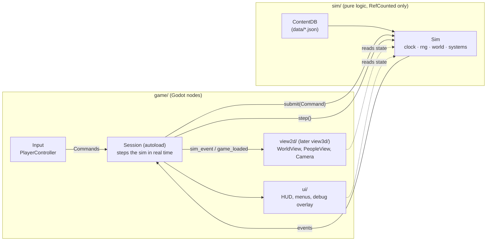

# Architecture

How Last Tram is put together, and the rules that keep it changeable. **Only the architect
(Claude Code / Opus) edits this file.** Builders who think something here is wrong write that
in their ticket's notes.

## The one big idea: a pure simulation with a replaceable view



- **`sim/`** is the game. It holds all state and rules: time, the town grid, people, and later
  objects, needs, jobs, crime and so on. It is plain GDScript (`RefCounted`): no nodes, no
  scenes, no input, no rendering, no real time, no global randomness. It runs identically
  with or without graphics, which is why tests and `tools/simrun.sh` can run it headless.
- **`game/`** is a window onto the sim. It draws the state, turns input into **Commands**, and
  never writes sim state directly. The 2D view lives in `game/view2d/`; a future 3D isometric
  view would be a sibling `game/view3d/` reading the same sim.
- **`data/`** is content (terrain, districts, and later objects, interactions, jobs, names),
  loaded and validated by `ContentDB`.

These rules are enforced by lint tests (`tests/lint/`), not just by convention. The lints
are best-effort textual checks: they catch the obvious shapes of a violation, while reviews
remain the backstop for anything a regex cannot see.

## Folder map

```
sim/                      pure simulation (no Nodes)
  sim.gd                  Sim: the root. step(), submit(), systems list
  sim_factory.gd          new games and ASCII test worlds
  core/                   SimClock, SimRng, EventLog, Command, CommandRegistry, Ser
  commands/               one file per Command subclass
  content/                ContentDB, ContentReader, one *Loader per kind of content, *Def
                          classes (the only sim code allowed to read files)
  world/                  World (all entities), WorldGrid (cells, levels, terrain),
                          WorldObject, Pathfinder (walking routes, `sim.nav`), Lot/Lots
                          (access, opening hours), TierSettings, WorkSettings
  people/                 Person, Household, ResidentGenerator, Appearance, Outfit,
                          CharacterSpec, Personality, Mood, Names
  actions/                Action (one queued or running interaction, saved in the person's
                          queue), Interactions (what an object offers, slots), Requirements
                          (what a person may do now, and why not)
  ai/                     free will: Autonomy (options and the pick), Utility (scores),
                          Routines (daily rhythm, home needs)
  social/                 Social (relationships, moodlets, memories), Conversations,
                          Relationship, Memory, Moodlet
  economy/                Money, Wallet, Ledger, Groceries, Housing (rent, bills, benefit),
                          Moving (eviction, renting empty flats, newcomers)
  jobs/                   Jobs (positions, shifts), Employment, Careers (pay, performance),
                          Hiring, WorkSession/RabbitHoleWork/OnSiteWork/WorkSessions,
                          WorkResult, Staffing (who serves a shop now; derived, not saved)
  systems/                SimSystem subclasses, in Sim.default_systems() order (below),
                          plus SocialActions (talking to people, used by ActionSystem)
  save/                   SaveCodec, SaveMigrations, SaveValidator/SavePersonValidator/
                          SaveSchema, Replay
game/                     Godot side
  session.gd              autoload "Session": owns the Sim, runs it, loads and saves
  main.tscn / main.gd     entry point; builds views and UI; command-line options
  launch_options.gd       the command-line options (screenshots, tools)
  save_slots.gd           save slots and autosave; save_file.gd writes atomically
  input/                  InputActions (bindings in code), PlayerController
  view2d/                 WorldView2D, ObjectsView2D, PeopleView2D, PersonView2D,
                          CameraRig2D, PathMarker2D, placeholder tiles
  dialogue/               speech-bubble text for the view
  ui/                     Hud, NeedsPanel, InteractionMenu, ActionQueuePanel, PersonInspector,
                          PauseMenu, MainMenu, CharacterCreator, MapView/TownMap,
                          BubblesLayer, ScenePopup, DebugOverlay...
    phone/                Phone and its apps (BankApp, JobsApp, ContactsApp)
data/                     content JSON + district ASCII maps
tests/                    runner, TestCase base, sim/ (behaviour), game/ (UI logic and
                          wording), lint/ (architecture rules, docs), fixtures
tools/                    check/test/run/simrun/screenshot/tickets scripts, TownCheck
docs/                     vision, roadmap, architecture, decisions, design/, conventions,
                          cookbook, workflow, playtesting, handoff
tickets/                  one markdown file per ticket
art/                      art sources and exports (after the art gate)
```

## The sim

### Time: fixed steps

- `SimClock.tick` counts steps. **20 steps = 1 game minute** (one step = 3 game seconds).
- `Sim.step()`: apply pending commands → every system's `step()` → `tick += 1` → if a minute
  just completed, every system's `on_minute()`.
- Fast per-step work (movement) goes in `step()`; everything else (needs, AI, schedules,
  economy) goes in `on_minute()` or on a coarser cadence checked inside it.
- `Session` runs `20 × speed` steps per real second (speed 0–3) and gives the view `alpha`
  (0..1) to interpolate between the last two steps. Game speed is a view setting, not sim
  state.

### State: World and entities

- `World` owns everything that changes: `grid`, `people`, `objects`, `lots`, `households`,
  the `ledger` and the world settings (`tiers`, `work`); later `vehicles`...
- **Entities reference each other by integer id**, never by object reference, in anything that
  is saved. Ids come from `World.new_id()` and are unique across all kinds of entity.
- Derived caches (walkability, pathfinding graphs in `sim.nav`, spatial indexes) are allowed,
  but must be rebuildable from saved state and are never saved themselves.
  `WorldGrid.revision` tells caches when to rebuild.

### Systems

- A `SimSystem` has `step(sim)` and `on_minute(sim)` and **no state of its own**. The order is
  defined in one place: `Sim.default_systems()`.
- Today: Tier → Action → Movement → Needs → Social → Work → Economy → Autonomy (see the
  comment on `Sim.default_systems()`). `WorkSystem` goes before free will (obligations
  first: leaving for a shift, settling shifts, missed shifts); `EconomySystem` runs the
  weekly cycle (benefit, rent, wages); `AutonomySystem` goes last, after the minute's needs
  have changed. Crime and police come in M4.

### Input: Commands

- Everything that changes the sim from outside is a `Command` (in `sim/commands/`), queued with
  `Sim.submit()` and applied at the start of the next step. Commands validate themselves and
  are ignored if invalid.
- Commands serialize (`CommandRegistry`), so they can be saved (pending ones), logged, and
  **replayed**: the M1 bug-report tool reproduces a session from a save plus the command log.
- The same commands serve direct control, command mode and (later) scripted tests. Direct and
  Sims-style control are two front ends to one system.

### Output: Events

- `sim.emit_event(type, data)` records what happened ("person_spawned", later "action_started",
  "crime_witnessed" and so on). `Session` drains the queue every frame and re-emits each event
  as the `sim_event` signal.
- Events are output only: the sim never reads them, and they are not saved. After a load,
  views rebuild from state (`game_loaded`), then follow events.

### Determinism

Same content + same seed + same commands at the same ticks = **bit-identical state**. It is
tested (`test_save_and_continue_equals_uninterrupted_run`) and it is what makes replays, bug
reports and "run 30 days headless" tests trustworthy. To keep it:
- All randomness comes from `sim.rng.stream("<system name>")`, one stream per system.
- No real time, no frame time, no iteration over unordered collections whose order could vary
  (GDScript dictionaries keep insertion order, which is fine).
- Floats are fine (same machine, same results); saves store them exactly. Godot's JSON parser
  reads some decimals back a bit off, so `Ser.to_json` writes those floats as `"#f64:<hex>"`
  and `Ser.parse_json` restores them (D26). Read save and command-log text with
  `Ser.parse_json`, never `JSON.parse`.

### Content: data-driven, validated

- Content is JSON in `data/` plus ASCII maps for districts. `ContentDB` loads it once, checks
  every field and every cross-reference, and collects errors instead of crashing. A test
  requires zero errors. Each kind of content has its own static `*Loader` (terrain, needs,
  names, appearance, clothing, world...) that reads through `ContentReader`; `load_from()`
  calls them in dependency order.
- Saves store **ids**, not indices (the grid saves a terrain palette), so adding or reordering
  content never breaks saves.
- `debug_color` is the only view-related field allowed in content. Real art is mapped by id in
  separate art data (see [art.md](art.md)).

### Saving

- `SaveCodec` turns the Sim into a JSON-safe Dictionary and back. It is pure: `Session` does
  the file IO.
- `SAVE_VERSION` + `SaveMigrations` (one step per version) + a **fixture save per version** in
  `tests/fixtures/saves/`, which must always still load. Old saves survive updates.
- Every state field must be in the save. The "save mid-run equals uninterrupted run" test
  fails if something is missing.

## The game layer

- **Session (autoload)** is the only bridge: it owns `content` and `sim`, steps the sim,
  forwards events, and handles speed, save/load and the command log. Only Session advances
  time (lint-enforced).
- **Views** (`game/view2d/`) read state every frame and rebuild on `game_loaded`. They convert
  cells to pixels (`ViewConfig.TILE_PX`); the sim never knows about pixels.
- **UI** (`game/ui/`) is built in code (no hand-edited scene files) and reads state; buttons
  submit commands through `Session.submit()`.
- **Input** bindings are registered in code (`InputActions`), using physical keys so WASD works
  on QWERTZ.

## Verification (for an owner who doesn't read code)

| Tool | Proves |
|---|---|
| `tools/check.sh` | Everything compiles, all tests pass, and architecture rules hold. Runs on every commit (pre-commit hook). |
| `tests/lint/*` | sim/ purity, the game/sim boundary, and every script compiling. |
| `tools/simrun.sh` | The sim behaves over hours or days without graphics (reports grow with each system). |
| `tools/screenshot.sh` | What it looks like: agents open the PNG and check it. |
| F3 overlay | Live internals while playtesting. |
| F9 bug report + replay (M1) | Any bug the owner hits can be reproduced headless. |

## Built to be replaced

Each placeholder has a seam, so the real thing can replace it without touching the rest:

| Today | Later | The seam |
|---|---|---|
| 2D top-down view | 3D low-poly isometric view | The sim knows nothing about rendering. The grid already has levels. A `view3d/` reads the same state and events. |
| Tiered NPC simulation | "Full lives for everyone" | One Person model; a tier is just how often and how precisely a person is updated. Tier radius and intervals are settings (the fidelity dial). |
| Rabbit-hole jobs | Playable jobs | A `WorkSession` interface. Each job id maps to an implementation; the default is the rabbit hole. |
| Systemic social actions | LLM-written dialogue | Every social action produces a `SocialExchange` record; a `DialogueProvider` turns it into text. The LLM version only writes text and never changes sim state. |
| Walking and transit | Bikes, scooters, cars | Movement modes, surfaces (sidewalk, road, rail) in terrain data, and a generic Vehicle entity. |
| One district | Many districts | Districts are data with an origin; the world is their union. |
| Placeholder art | Real sprites or tiles | Art is looked up by content id with a fallback to the placeholder. `TILE_PX` is one constant. |
| Placeholder figures | Layered character sprites and portraits | Appearance and outfit are sim data (ids); the view maps ids to simple shapes now and to sprite layers later. |
| Core content only | The owner's own content packs, adult ones included | Packs are data-only folders loaded after `data/` through the same validators. Presentation goes through scene ids; packs add scene variants, and adult ones are used only when the adult setting is on. The guardrails live in sim code and validation, never in data ([design/content-packs.md](design/content-packs.md)). |

## Performance budget

- Target: 60 FPS at 3x speed with ~150 residents on an M-series Mac. Sim cost at most
  ~4 ms per frame.
- The F3 overlay shows sim ms per frame; `tools/simrun.sh` prints ms per step.
- If GDScript becomes the bottleneck, hot paths can move to C# or GDExtension later, behind the
  same classes. Profile first; the tiers exist to make this unlikely.

## Module plan (where upcoming systems will live)

Only what is still to come; the folder map above shows where built systems live.

| Milestone | Module | Location |
|---|---|---|
| M3 | Discoveries | `sim/content/discovery_def.gd`, `data/discoveries/`, `sim/discoveries/`, the Notebook app in `game/ui/phone/` |
| M3 | Skills, wardrobe, backgrounds | `sim/people/` (skills, owned clothes), `sim/content/` (backgrounds), `game/ui/` (creator) |
| M4 | Health, crime, witnesses, police | `sim/crime/`, `sim/health/` |
| M5 | Build mode rules | `sim/build/` (commands + validation) |
| M5 | Content packs, settings | `sim/content/pack_loader.gd`, `game/settings.gd`, `game/ui/packs_screen.gd`, `examples/packs/` |
| M6 | Intimacy rules (consent, capacity, no crime) | `sim/social/intimacy_rules.gd` |
| M7 | Transit, vehicles | `sim/transport/` |
